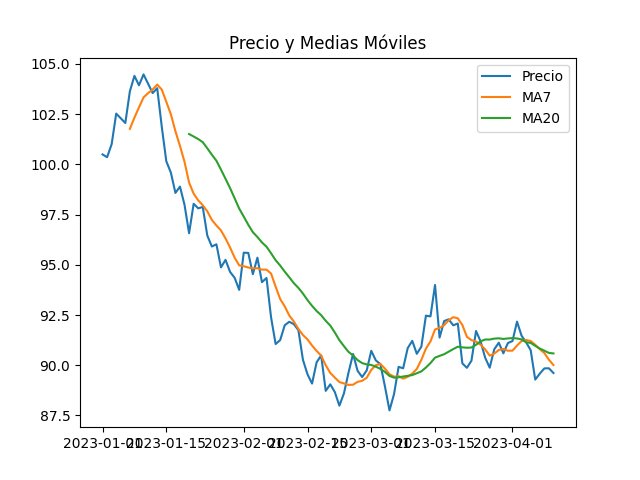
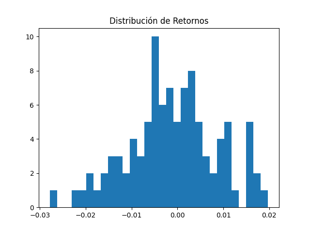

# Análisis de Acciones con Python

## Descripción

Este proyecto está enfocado en el análisis de datos financieros utilizando Python, con el objetivo de estudiar el comportamiento de distintas acciones en el mercado.

Se trabaja con datos históricos para analizar precios, tendencias y variaciones, y obtener una visión más clara del rendimiento de los activos.

---

## Problema

En el ámbito de la inversión, es común disponer de grandes cantidades de datos, pero no siempre están estructurados de forma que permitan analizarlos fácilmente.

Esto dificulta comparar acciones, entender su evolución o evaluar el riesgo y la rentabilidad de una inversión. Python permite organizar y analizar estos datos de forma estructurada, facilitando la toma de decisiones basada en datos reales. :contentReference[oaicite:0]{index=0}

---

## Objetivo

El objetivo de este proyecto es desarrollar un sistema de análisis que permita:

- Obtener datos históricos de acciones  
- Analizar su evolución en el tiempo  
- Calcular métricas relevantes como rentabilidad y variación  
- Visualizar los resultados de forma clara  

---

## Tecnologías utilizadas

- Python  
- Pandas  
- NumPy  
- Matplotlib  
- Datos financieros (CSV o APIs)  

---

## Funcionalidades

- Análisis de precios históricos de acciones  
- Cálculo de rentabilidad  
- Estudio de tendencias  
- Visualización de datos mediante gráficos  
- Comparación entre diferentes activos  

---

## Insights

A partir del análisis se pueden obtener conclusiones como:

- Qué acciones han tenido mejor rendimiento en un periodo determinado  
- Cómo ha evolucionado el precio a lo largo del tiempo  
- Niveles de volatilidad (riesgo)  
- Comparación entre diferentes activos financieros  
- Identificación de tendencias de subida o bajada  

---

## Valor

Este tipo de proyecto permite entender mejor el comportamiento del mercado financiero y aplicar análisis cuantitativo sobre datos reales.

Ayuda a tomar decisiones más informadas, basadas en datos y no únicamente en intuición, lo cual es clave en el análisis de inversiones.

---

## Repositorio

https://github.com/light-stereo/analisis-acciones-python  

---

## Autor

Marileysis Peña Aquino  
pmarileysis@gmail.com  
https://github.com/light-stereo  

---

## Notas

Este proyecto forma parte de mi aprendizaje en análisis de datos aplicado a finanzas, con el objetivo de seguir desarrollando habilidades en Python y análisis cuantitativo.

#  Análisis de Acciones con Python
##  Ejemplo de resultados

Proyecto básico de análisis financiero usando Python.

## Cómo usar

pip install -r requirements.txt
python generar_datos.py
python analisis.py
